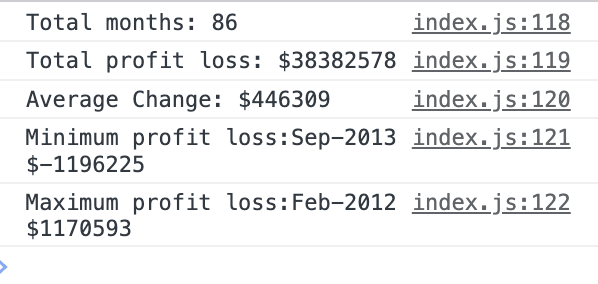

## Table of Contents
* [Descritpion](#description)
* [URLS](#urls)
* [Screenshot](#screenshot)

## Description
*  I have created a code for analyzing the financial records of a company base on the financial dataset provided. The dataset is composed of arrays with two fields, Date and Profit/Losses. 
My task was to write JavaScript code that analyzes the records to calculate each of the following:

* The total number of months included in the dataset.

* The net total amount of Profit/Losses over the entire period.

* The average of the changes in Profit/Losses over the entire period.

* The total change in profits from month to month and then find the average change.

* The greatest increase in profits (date and amount) over the entire period.

* The greatest decrease in losses (date and amount) over the entire period.

# URLS
## Github Repo
* https://github.com/clarajime/Console-Finances.git

## Live URL
* https://clarajime.github.io/Console-Finances/

## Screenshot
* Demo of the result in the console

## License 
MIT License

Copyright (c) 2023 Clara Jimenez

